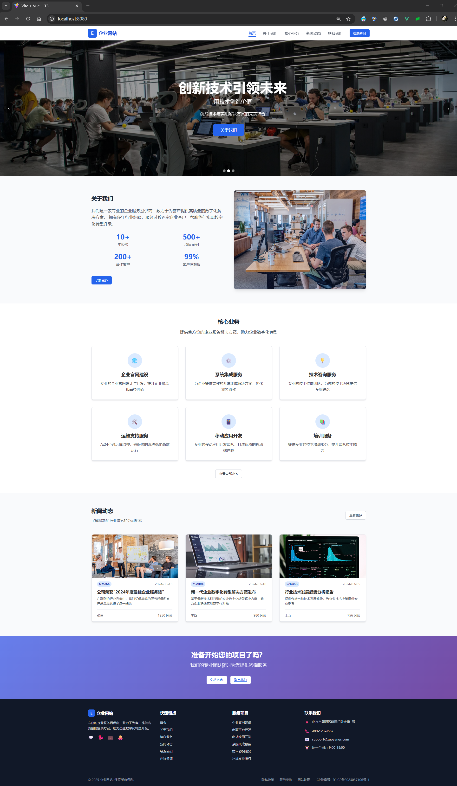
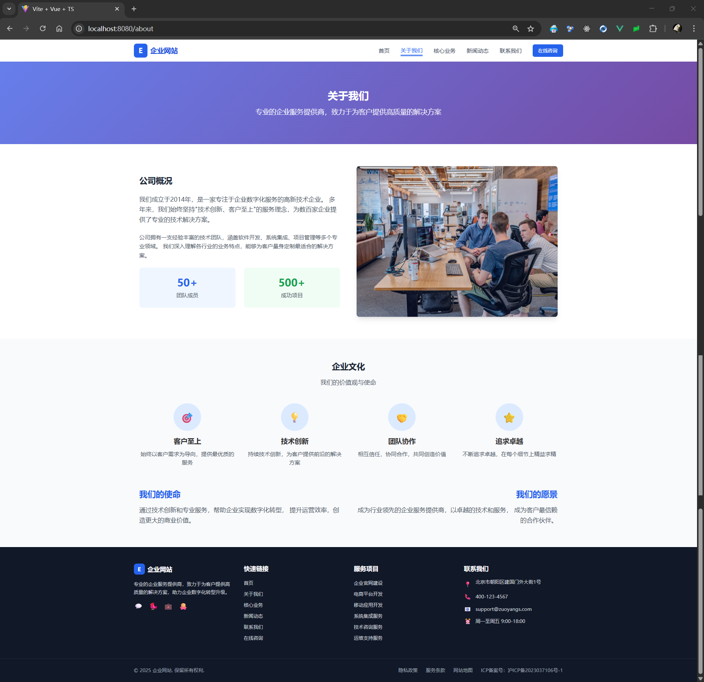
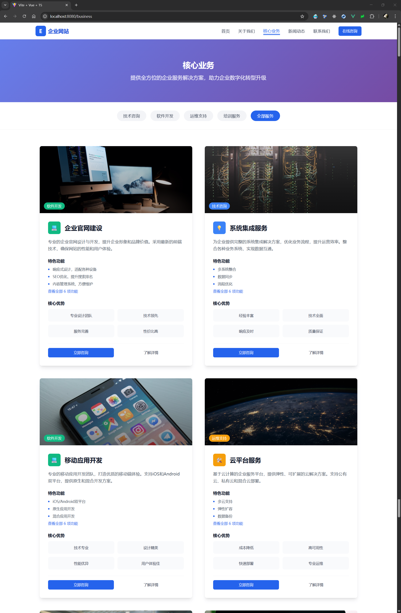
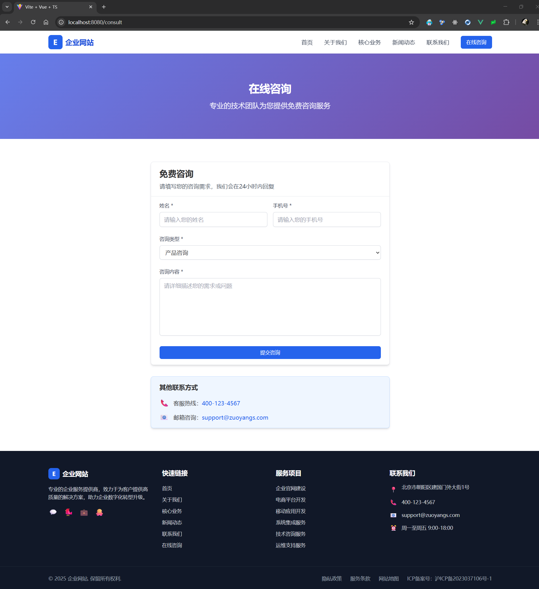
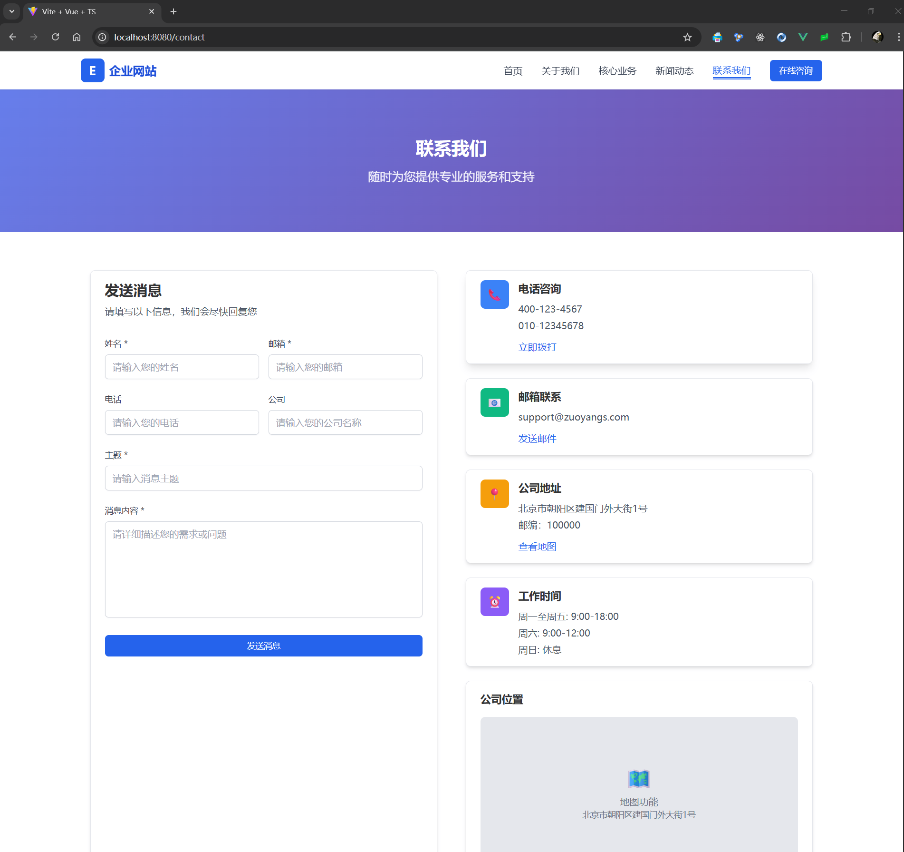

# 现代化企业官网模板

[](https://vuejs.org/)
[](https://www.typescriptlang.org/)
[](https://tailwindcss.com/)
[](https://vitejs.dev/)

一个基于 Vue 3 + TypeScript + Tailwind CSS 构建的现代化企业官网模板，包含完整的企业网站功能模块，适合快速开发和部署企业官方网站。

## 🖼️ 界面预览

### 首页


### 关于我们


### 核心业务


### 新闻动态


### 在线咨询


### 联系我们


## ✨ 特性

- 🚀 **现代化技术栈**：Vue 3 + TypeScript + Vite + Tailwind CSS
- 📱 **响应式设计**：完美适配桌面端和移动端
- 🎨 **优雅界面**：基于 Tailwind CSS 的现代化 UI 设计
- 🔥 **热更新开发**：Vite 提供极速的开发体验
- 📦 **组件化架构**：高度可复用的 Vue 组件
- 🛣️ **路由管理**：Vue Router 4 实现的单页应用
- 💾 **状态管理**：Pinia 轻量级状态管理
- 🌐 **国际化友好**：支持中文字体优化
- 🔍 **SEO 优化**：结构化的页面布局和元数据

## 📋 功能模块

- **首页（Home）**：企业形象展示和核心业务介绍
- **关于我们（About）**：公司简介、发展历程、企业文化
- **业务展示（Business）**：核心业务和服务介绍
- **新闻资讯（News）**：企业动态和行业资讯
- **联系我们（Contact）**：联系方式和在线留言
- **在线咨询（Consult）**：客户咨询和服务支持

## 🛠️ 技术栈

- **前端框架**：Vue 3.5.18
- **开发语言**：TypeScript 5.8.3
- **构建工具**：Vite 7.1.2
- **UI 框架**：Tailwind CSS 3.4.17
- **路由管理**：Vue Router 4.5.1
- **状态管理**：Pinia 3.0.3
- **HTTP 客户端**：Axios 1.11.0
- **开发工具**：Vue TSC、PostCSS、Autoprefixer

## 🚀 快速开始

### 环境要求

- Node.js >= 16.0.0
- npm >= 8.0.0

### 安装依赖

```bash
# 克隆项目
git clone https://github.com/zuoyangs/vue3-enterprise-website.git

# 进入项目目录
cd vue3-enterprise-website

# 安装依赖
npm install
```

### 开发模式

```bash
# 启动开发服务器
npm run dev
```

访问 [http://localhost:8080](http://localhost:8080) 查看项目。

### 生产构建

```bash
# 构建生产版本
npm run build
```

### 预览构建结果

```bash
# 预览生产构建
npm run preview
```

## 📁 项目结构

```
src/
├── assets/                # 静态资源
│   ├── images/            # 图片资源
│   └── styles/            # 样式文件
├── components/            # 可复用组件
│   ├── FaqItem.vue       # FAQ 项目组件
│   ├── Footer.vue        # 页脚组件
│   ├── Navbar.vue        # 导航栏组件
│   └── Swiper.vue        # 轮播图组件
├── router/                # 路由配置
├── stores/                # Pinia 状态管理
├── types/                 # TypeScript 类型定义
├── utils/                 # 工具函数
├── views/                 # 页面组件
│   ├── About/            # 关于我们页面
│   ├── Business/         # 业务展示页面
│   ├── Consult/          # 在线咨询页面
│   ├── Contact/          # 联系我们页面
│   ├── Home/             # 首页
│   └── News/             # 新闻资讯页面
├── App.vue               # 根组件
├── main.ts               # 应用入口
└── style.css             # 全局样式
```

## 🎨 自定义配置

### Tailwind CSS 配置

项目使用 Tailwind CSS 进行样式管理，配置文件位于 `tailwind.config.js`。

### 字体配置

项目针对中文环境进行了字体优化，优先使用微软雅黑、苹方等中文字体。

### 路由配置

所有路由配置位于 `src/router/index.ts`，支持懒加载和动态路由。

## 🤝 贡献指南

1. Fork 本仓库
2. 创建特性分支 (`git checkout -b feature/AmazingFeature`)
3. 提交更改 (`git commit -m 'Add some AmazingFeature'`)
4. 推送到分支 (`git push origin feature/AmazingFeature`)
5. 打开 Pull Request

## 🙏 致谢

- [Vue.js](https://vuejs.org/) - 渐进式 JavaScript 框架
- [TypeScript](https://www.typescriptlang.org/) - JavaScript 的超集
- [Tailwind CSS](https://tailwindcss.com/) - 功能优先的 CSS 框架
- [Vite](https://vitejs.dev/) - 下一代前端构建工具
---

⭐ 如果这个项目对您有帮助，请给它一个星标！
